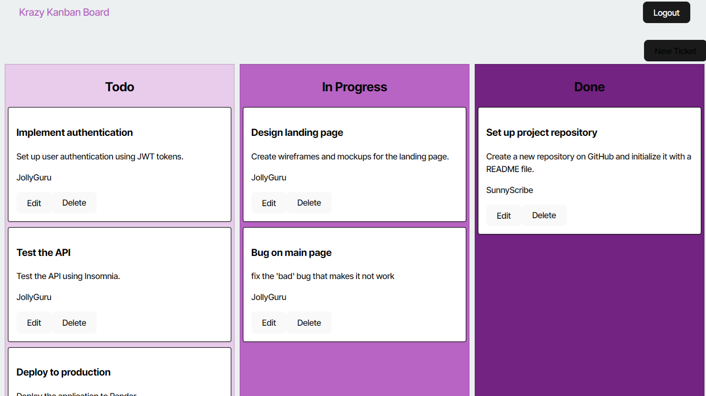

# AuthKanban

## Description
This project is a Kanban Board application designed for task management, featuring a secure authentication system using JSON Web Tokens (JWT). Users must log in to access their team-based Kanban board, ensuring a secure and private workspace.

## Table of Contents
 - [Installation](#installation)
 - [Usage](#usage)
 - [Credits](#credits)
 - [License](#license)
 - [Badges](#badges)
 - [Tests](#tests)
 - [Questions](#questions)

## [Installation](#installation)
  1. Clone this repo locally;
  2. Install dependencies by running `npm run install` in your terminal from the root; 
  3. Run build with `npm run build`;
  4. Create sql database and run schema with `\i schema.sql`
  5. Seed sql database with `npm run seed` and
  6. `npm start:dev` to start locally and open `http://localhost:3000/` or applicable port.

  ## [Usage](#usage)
  Use this keep track of tickets to work, in progress or complete.. View live version here: [AuthKanban](https://authkanban.onrender.com/). You can login with username: `SunnyScribe` and password: `password`. 
  
  > 1. Click create for a new ticket;
  > 2. Click edit on each card to change statues or contents;
  > 3. Click delete to remove a card;
  > 4. Select Logout when complete;
  > 5. Authentication will expire after 1 hour.;

  ### Application Screenshot
  

  ## [Credits](#credits)
  - [dotenv](https://www.npmjs.com/package/dotenv)
  - [bcrypt](https://www.npmjs.com/package/bcrypt)
  - [express](https://expressjs.com/)
  - [jsonwebtoken](https://www.npmjs.com/package/jsonwebtoken)
  - [pg](https://www.npmjs.com/package/pg)
  - [sequelize](https://sequelize.org/)
  - [jwt-decode](https://jwt.io/)
  - [react](https://react.dev/)
  - [react-dom](https://www.npmjs.com/package/react-dom)
  - [react-router-dom](https://www.npmjs.com/package/react-router-dom)
   - In Dev
      - [concurrently](https://www.npmjs.com/package/concurrently)
      - [nodemon](https://nodemon.io/)
      - [wait-on](https://www.npmjs.com/package/wait-on)
      - [eslint](https://eslint.org/)
      - [vite](https://vite.dev/)
  
  ## [License](#license)
  This project is licensed under the MIT - see the [LICENSE](LICENSE) file for details.

  ## [Badges](#badges)
  

  ## [Tests](#tests)
   Follow [Installation](#installation) and run application locally. You'll need to include your own `DB_NAME, DB_USER, DB_PASSWORD, JWT_SECRET_KEY` in `.env file.` Follow errors for tracing.
  
  ## [Questions](#questions)
  If you have any questions, please feel free to reach out to me at musserdn@gmail.com or visit my [GitHub Profile](https://github.com/musserdn/).